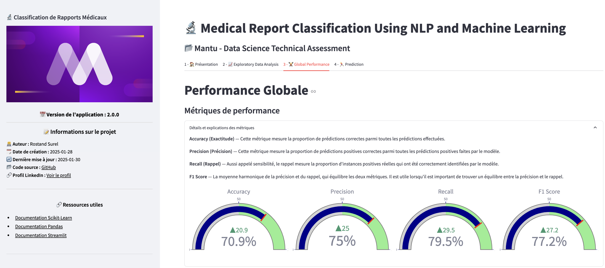

# **Classification des Rapports Médicaux avec NLP et Machine Learning**  

## 📌 Mantu - Évaluation Technique en Data Science  
### 🏥 Solution Python pour la Classification Multi-Classes de Textes  

👤 **Réalisé par** : [Rostand Surel](https://www.linkedin.com/in/rostand-surel/)  
📌 **GitHub** : [Manda404](https://github.com/Manda404)  

  

---

## **🎯 Objectif du Projet**  

### 📂 **Jeu de Données**  
- Analyse d’un dataset comprenant **2 286 rapports médicaux**, extrait d’un sous-ensemble de **HuggingFace**.  
- Les rapports médicaux sont classés en **cinq catégories principales** :  
  - **Neoplasms** (Tumeurs)  
  - **Digestive System Diseases** (Maladies du système digestif)  
  - **Nervous System Diseases** (Maladies du système nerveux)  
  - **Cardiovascular Diseases** (Maladies cardiovasculaires)  
  - **General Pathological Conditions** (Conditions pathologiques générales)  

### 🔍 **Objectif**  
- Développer une **solution en Python** capable de **prédire la spécialité médicale** associée à un rapport médical donné.  

---

## **🛠 Approche Méthodologique**  

### 1️⃣ **Prétraitement du texte** 📝  
- Nettoyage des données (ponctuation, stopwords, stemming/lemmatisation).  
- Vectorisation du texte avec **TF-IDF** et **embeddings pré-entraînés**.  

### 2️⃣ **Expérimentation de plusieurs approches** 🤖  
- Modèles classiques de Machine Learning :  
  - **Régression Logistique**  
  - **SVM** (Support Vector Machines)  
  - **Random Forest**  
- Modèles avancés de Deep Learning :  
  - **LSTM (Long Short-Term Memory)**  
  - Transformers basés sur **BERT (Bidirectional Encoder Representations from Transformers)**  

### 3️⃣ **Sélection et évaluation des modèles** 📊  
- Comparaison des modèles à l’aide des **métriques de performance** adaptées.  

### 4️⃣ **Optimisation et interprétation des résultats** 📈  
- Analyse des erreurs avec **matrices de confusion et classification report**.  
- Affinage des hyperparamètres pour améliorer les prédictions.  

---

## 📌 **Installation & Utilisation**  

### 🚀 **Installation**  
```bash
# Cloner le repository
git clone https://github.com/Manda404/MANTU_AI_Technical_Test.git
cd MANTU_AI_Technical_Test

# Créer un environnement virtuel et installer les dépendances
python -m venv env
source env/bin/activate  # Sur Windows : env\Scripts\activate
pip install -r requirements.txt
```

### ▶ **Exécution**  
```bash
python main.py
```

---

## 📜 **Résultats et Analyse**  

- Les performances des modèles ont été évaluées via des métriques standards (**F1-score, précision, rappel**).  
- Comparaison entre modèles classiques et avancés (**BERT, LSTM vs. SVM, Random Forest**).  
- Optimisation des hyperparamètres pour améliorer la généralisation.  

📊 **Résumé des résultats** disponible dans le dossier `reports/`.  

---

## 📌 **Contributions & Contact**  

📧 **Contact** : rostand.surel@yahoo.com  
💡 **Suggestions & Contributions** bienvenues via **Pull Requests** ou **Issues** sur GitHub !  

---

© 2025 Rostand Surel - Projet réalisé dans le cadre de l'évaluation technique chez Mantu. 🚀
